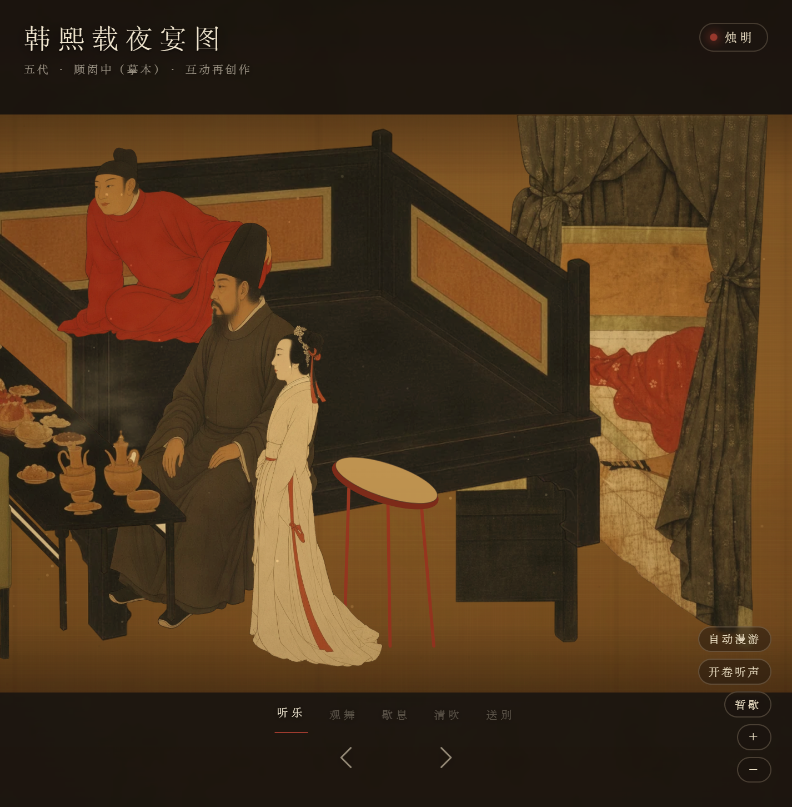
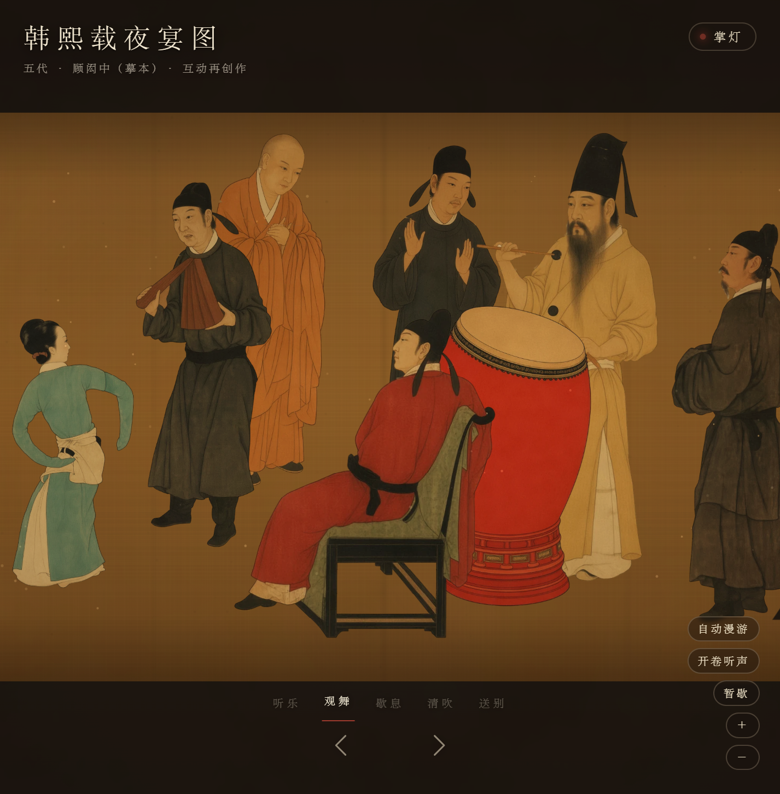
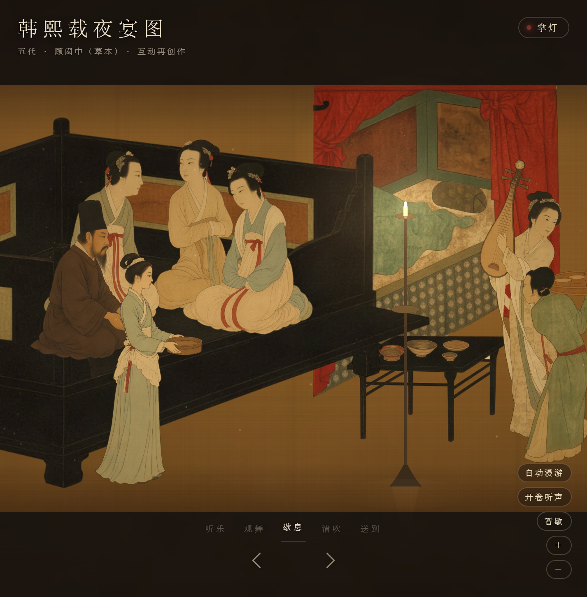
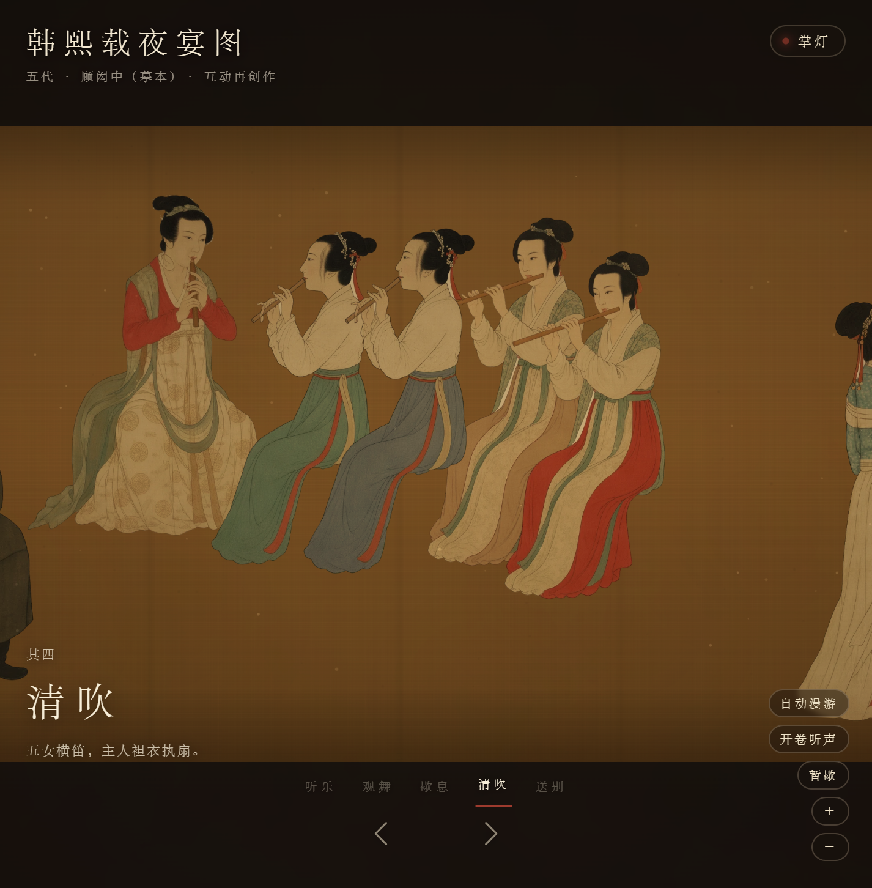
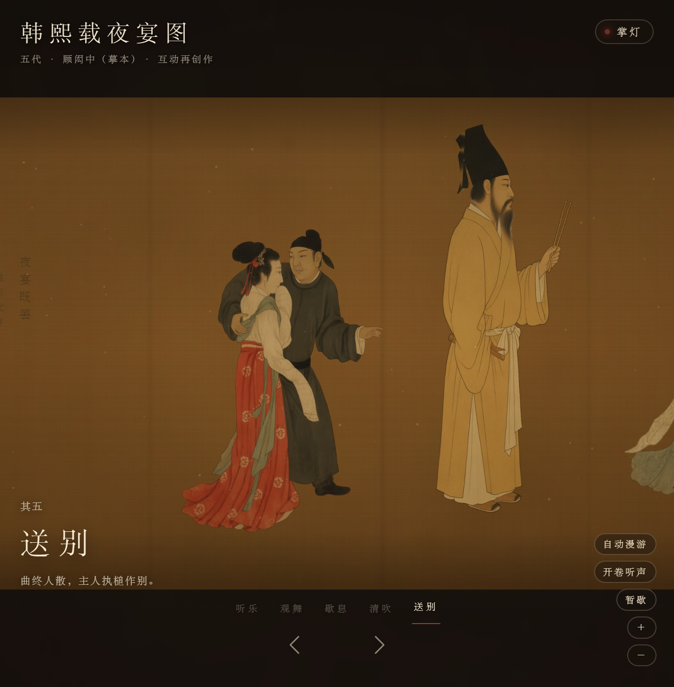
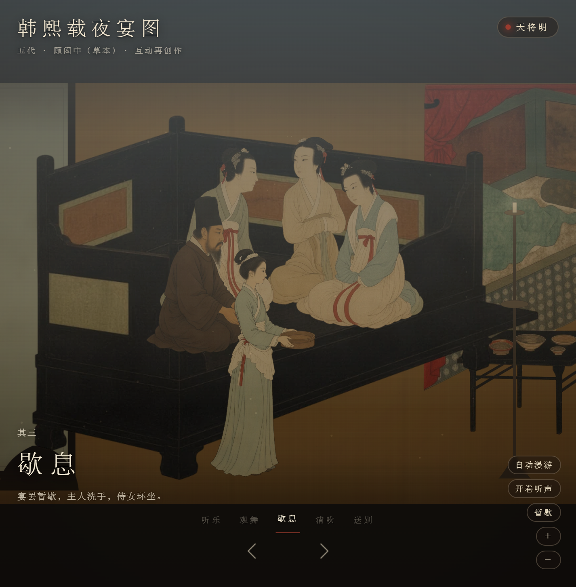

# 韩熙载夜宴图 · 可漫游的夜宴长卷

**在线体验**：<https://singz.cn/hanxizai/> · 无框架、无构建、无网络请求，双击 `index.html` 也能跑

An interactive, walkable handscroll of *Han Xizai's Night Revels* (五代 · 顾闳中): five scenes, candle-lit ambience, a shared score, 28 annotations. Vanilla JavaScript — Canvas 2D + WebGL + Web Audio, no framework, no build step, no external assets.

把五代顾闳中的《韩熙载夜宴图》从一张静止的手卷，还原成一段可以走进去的夜宴：长卷自右向左展开，依次是听乐、观舞、歇息、清吹、送别，烛影从掌灯一直摇到天将明。

画中每一个人、每一件床榻屏风，都按原作同一位置的局部重新生成为分层素材，再摆回原画上的同一个框里：位置、朝向、衣色、前后遮挡与原作一致。

**运行**：直接双击 `index.html`（没有构建、没有网络请求，素材元数据是普通脚本，贴图用 `` 加载）。若浏览器限制了 `file://`，用 `python scripts/preview.py` 起一个本地服务。

| 其一 · 听乐 | 其二 · 观舞 |
| --- | --- |
|  |  |
| 其三 · 歇息 | 其四 · 清吹 |
|  |  |
| 其五 · 送别 | 天将明 |
|  |  |

与原作的逐段对照（上为原作，下为素材按版式合成的结果）见 `docs/compare-*.jpg`。

## 五段，一条世界坐标轴

原作横向的每一个像素都对应世界坐标：`worldX = (原图 x − 4080) × 1.8`，`worldY = 原图 y × 1.8`。观众不是在五张图之间跳转，而是沿同一条轴走完整卷；屏风既是家具，也是段落之间的"幕"。

| 段 | 内容 | 可以做什么 |
| --- | --- | --- |
| 其一 · 听乐 | 李家小妹抱琵琶，满堂屏息 | 点击琵琶拨弦，满堂随乐声起伏 |
| 其二 · 观舞 | 王屋山踏六幺，主人亲擂羯鼓 | 按住鼓面蓄力、松开击鼓；鼓点合度则舞步更快，过猛则乱了半步 |
| 其三 · 歇息 | 宴罢暂歇，主人洗手，侍女环坐 | 点击烛火剪烛花；托盘侍女会把茶点送到床前再回来 |
| 其四 · 清吹 | 五女横笛，主人袒衣执扇 | 点击乐女起拍收拍，笛声按画面位置左右分开 |
| 其五 · 送别 | 曲终人散，主人执槌作别 | 走到卷尾，落款用印 |

更漏是全局的：**掌灯 → 烛明 → 烛影摇红 → 香尽 → 更残漏尽 → 天将明**。这条时间轴同时决定火光、香烟、色调与声音；静止的床榻与活动的人物共用同一层氛围着色。

## 配乐与人物

配乐是一支 D 宫五声调式的小曲（`src/score.js`，简谱写成，64 拍一轮），各段乐器从同一支旋律派生，随镜头位置交叉淡入：听乐是琵琶（长音用轮指），观舞是琵琶伴鼓与击掌，歇息是琴，清吹是四笛一筚篥加拍板，送别只剩几声余音。

人物读的是同一份乐谱：琵琶女的手在每个起音上拨下，乐女在句末换气，舞起之后韩熙载按鼓谱落槌，宾客应节击掌。没有乐器的人也一直在动：呼吸（吸短呼长）、重心慢慢游移、隔一阵抬眼望一望、身子朝这一段的焦点微倾，每个人的速度与相位都不同。所有姿态经临界阻尼弹簧平滑，不会跳变。

## 看原图

右下角"看原图"打开全卷原作，自右向左读，从长卷当前所在处打开。画上的朱印小签是 28 则批注（人物、器物、画法、题跋、印鉴），指上去（触屏为点按）就有一张竖排旧纸从旁展开，朱线连回画上那一处，附延伸阅读链接；画心里的批注可以"入画"，回到长卷里同一处。批注数据在 `src/annotations.js`，旧说与推断都写明"相传""一般认为"。

## 操作

- `←` 沿卷前行（向卷尾），`→` 回看；也可以拖动、滚轮缩放（双击不缩放，免得连点人物时画面跳动）
- 点击画中人或器物：他会回应；`E` 相当于点击视线正中
- 底部五段名：跳到那一段
- 自动漫游 / 开卷听声 / 暂歇 / 看原图：右下工具；自动漫游遇到正在进行的六幺舞会停下来看完
- `空格` 暂歇，`Home` 回卷首，`End` 到卷尾
- 看原图里：拖动、滚轮或 `←` `→` 移卷，`PageUp` `PageDown` 上一则下一则，`Ctrl` + 滚轮缩放，`Esc` 收起批注或回到长卷
- 偏好"减少动态效果"时自动降低粒子与节奏

浏览器只允许在用户手势里发声：页面上第一次点按或按键时自动开卷听声；亲手按过"掩卷息声"之后就不再自动打开。

## 手机上看

- 单指左右拖动漫游，轻点人物器物，双指捏合缩放；看原图里同样单指移卷、双指缩放、点朱印看批注
- 竖屏时标题和工具收在上方暗带，段名与翻页箭头收在下方暗带，画面按高度留足；横屏能看到更宽的一段，矮横屏会把界面压得更紧
- 刘海、圆角和底部手势条都按 `env(safe-area-inset-*)` 让开
- 触屏下隐藏 `+` `−` 缩放按钮（用双指代替），按钮和朱印放大到便于手指点按
- 声音在手指抬起的那一下解锁（iOS 不认按下）；支持的浏览器会把音频会话设为 `playback`，iPhone 静音开关不会把配乐掐掉
- 帧率撑不住时自动降档：先把像素比上限从 2 降到 1.5，再减少人物分条变形的条数，最后降到 1 倍像素比

## 项目结构

```text
index.html               页面入口
styles/                  界面样式
img/                     原作全卷（12172×500），版式与素材都以它为准
assets/figures/raw/      生成的白底工笔立绘（42 张，素材的原料）
assets/figures/*.webp    流水线产出的分层图集（身体 + 可动部件）
src/figure-atlas.js      图集元数据：内容框、脸位、部件枢轴、锚点、矢量轮廓
src/layout.js            版式：每件素材在原画上的框、所属段落、z 次序与演出方式
src/sprite.js            素材渲染：分条形变（俯仰、摆动、裙摆）、部件转动、轮廓命中与高亮
src/plate.js             静止底图：旧绢、立柱、大屏风、题签；鼓架与烛台作为分层器物
src/score.js             乐谱：配乐与人物动作共用的一条时间线
src/scroll-life.js       时间轴编组：人物表、"活人"底子、按乐谱的招牌动作、弹簧平滑、走位
src/dance-event.js       六幺舞状态机（击鼓力度 → 舞步）
src/light.js             更漏氛围状态机、灯火与地面光池、香烟
src/audio.js             Web Audio 合成：按乐谱排程的琵琶、琴、鼓、笛、筚篥、拍板，分段总线与混响
src/smoke.js             WebGL 流体层：香烟与烛气，失败自动回退 Canvas
src/annotations.js       原作批注：28 则，坐标为原图像素
src/original.js          看原图：全卷查看、朱印批注、展开的批注卡、小地图
src/scene.js             相机、输入、命中测试、绘制循环与界面
scripts/build_figures.py 素材流水线：抠底、做旧、分件、换色、拆层、矢量遮罩
scripts/compose_layout.py 版式校验：把素材按 layout.js 合成，与原作上下对照
scripts/build_icons.py   站点图标：一方朱印「夜」，输出 favicon.ico 与 assets/icons/
tests/                   逻辑自测（不需要浏览器）
docs/DESIGN.md           设计说明：从《清明上河图》互动项目借来的方法
docs/ASSETS.md           素材清单：每件素材的出处框、生成方式与加工
```

## 重建素材

```sh
pip install pillow numpy scipy opencv-python
python scripts/build_figures.py            # 全部重建（约 3 分钟），--only l-han,d-drum 只建几件
python scripts/build_figures.py --debug    # 另存每件素材的检查图到 assets/figures/debug/
python scripts/compose_layout.py           # 重新生成 docs/compare-*.jpg
python scripts/build_icons.py              # 重新生成站点图标（用到 Windows 自带的隶书字体）
```

生成图的朝向和原作相反时，在 `build_figures.py` 的 SPEC 里加 `mirror=True`（如捧盆的侍女 `r-maid-front`），流水线会先翻转再抠底拆层。

## 自测

```sh
node tests/logic.test.cjs
```

版式、生活时间轴、乐谱、批注、六幺舞状态机、更漏氛围都是纯数据，可以脱离渲染验证：每件素材都落回原画上的同一个框、五段首尾相接、舞者两个姿势共用脚线、轮廓命中准确、人物不越界、托盘侍女走到床前再转身回来、鼓声推动鼓槌；乐谱每句八拍且分帧排程不漏音；60 帧下每帧姿态变化都很小、主要人物始终在动、琵琶女的手随起音拨下；批注不越界、按阅读顺序编号；无人介入也能走完舞曲、用力过猛反而拖慢进度。

## 关于这幅画

原画为五代顾闳中（宋摹本），现藏故宫博物院。本项目的人物与陈设不是原作的裁切：它们以原作局部为参考重新生成，再经流水线做旧、拆层，因此笔触与原作不同，但构图、人物关系与设色按原作摆放。绢地、立柱、大屏风、鼓架、烛台、火光、香烟与声音由代码生成。

## 许可

代码以 MIT 许可发布，见 [LICENSE](LICENSE)。原画为五代顾闳中（宋摹本），已属公共领域；`img/` 中的全卷图用作版式基准，`assets/figures/raw/` 是按原作局部重绘的生成图。
